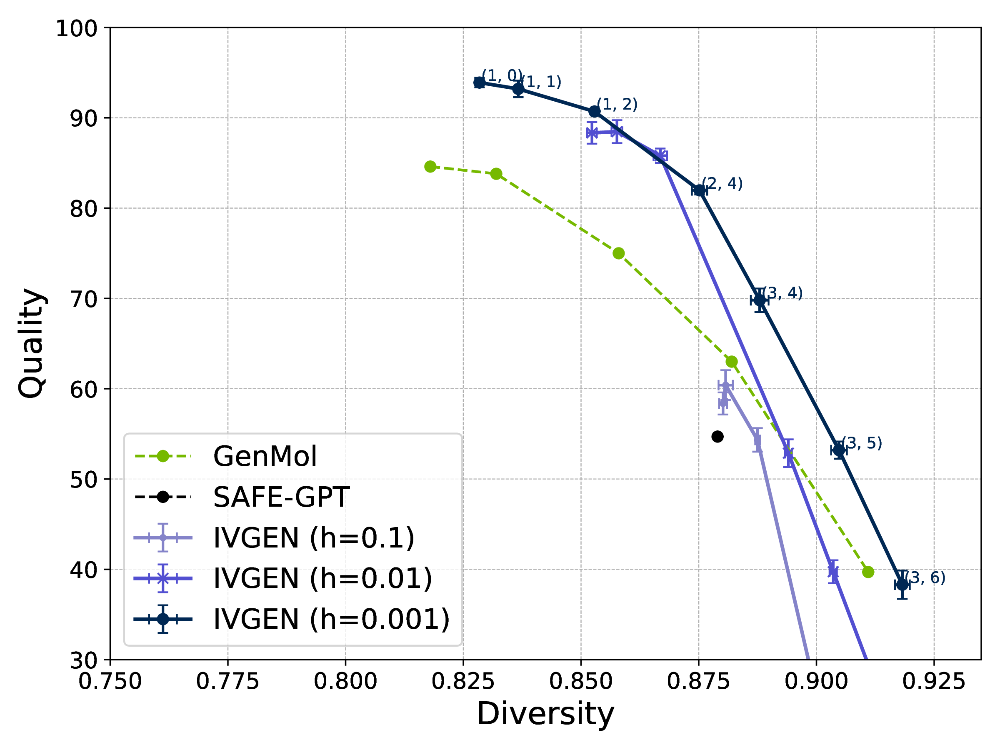
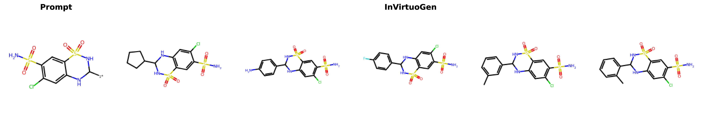
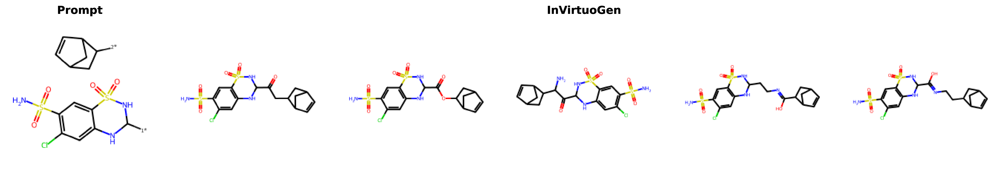
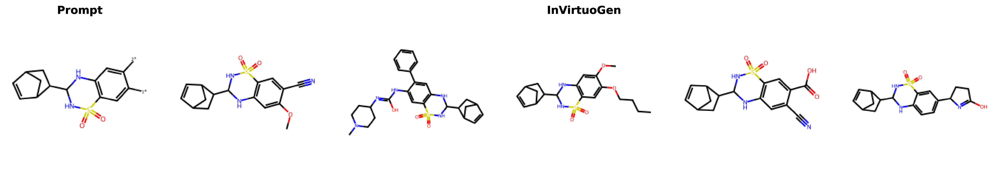

# InVirtuoGen: Uniform-Source Discrete Flows for Drug Discovery
Repository to reproduce results from the [paper](https://arxiv.org/abs/2509.26405).
## 🚀 Quick Start

### Setup Environment
On ARM-based environments
```bash
mamba create -n invgen python=3.10.16 -y
mamba activate invgen
pip install -r requirements.txt
pip install -e .
```
We also provide a Dockerfile for aarch64-based environments - the results from the paper were produced within the corresponding Docker container and should be reproducible - although we could not check it on another cluster.
### Download Checkpoints
```bash
mkdir checkpoints && cd checkpoints
curl https://zenodo.org/api/records/16874868/files-archive -o checkpoints.zip
unzip checkpoints.zip && unzip invirtuo_gen_big.ckpt.zip && unzip invirtuo_gen.ckpt.zip
cd ..
```

**Available Models:**
- `invirtuo_gen.ckpt` - Standard model for general use
- `invirtuo_gen_big.ckpt` - Larger model for optimal performance

**Quick Generation:**
```bash
python -m in_virtuo_gen.generate \
    --ckpt_path checkpoints/invirtuo_gen.ckpt \
    --num_samples 1000 \
    --batch_size 200
```

# Reproduce Results in Paper

## 1. De Novo Molecule Generation

### Reproduce Quality-Diversity Analysis:

(~6h on RTX 4090 for 3 seeds)
```bash
python -m in_virtuo_gen.evaluation.denovo \
    --checkpoint_path checkpoints/invirtuo_gen_big.ckpt \
    --dt 0.1 0.01 0.001 \
    --num_samples 1000 \
    --eta 999 \
    --num_seeds 3 \
    --device 0
```

## 2. Fragment-Constrained Generation
(<1h on RTX 4090 for 3 seeds)

Design molecules containing specific fragments while optimizing properties.




```bash
python -m in_virtuo_gen.evaluation.downstream \
--model_path checkpoints/invirtuo_gen_big.ckpt\
 --dt 0.01\
 --temperature 1\
 --noise 0\
 --eta 999\
 --device 0 --all
```

**Supported Tasks:**
- **Motif Extension** - Growing fixed motifs with new substituents
- **Linker Design** - Connecting fragments with feasible linkers
- **Scaffold Decoration** - Adding functional groups at defined positions
- **Superstructure Generation** - Assembling multiple fragments

## 3. Target Property Optimization
Optimize molecular properties using genetic algorithms + reinforcement learning.


**Setup Vocab:** (~12 hours - but note that it is already present in the zipped file)
```bash
mkdir -p data
wget -O data/frags_zinc250.csv https://zenodo.org/records/16742898/files/frags_zinc250.csv
python -m in_virtuo_reinforce.preprocess.get_vocab \
    --datapath data/frags_zinc250.csv \
    --outpath in_virtuo_reinforce/vocab/zinc250k.csv
```


### With Prescreening ZINC250k:
State-of-the-art results on PMO benchmark

| Oracle                   | InVirtuoGen              | GenMol  | f-RAG  |
|--------------------------|--------------------------|---------|--------|
| albuterol similarity     | 0.975 (±0.016)           | 0.937   | **0.977** |
| amlodipine mpo           | **0.836 (±0.031)**       | **0.810** | 0.749  |
| celecoxib rediscovery    | **0.839 (±0.013)**       | 0.826   | 0.778  |
| deco hop                 | **0.968 (±0.012)**       | **0.960** | 0.936  |
| drd2                     | **0.995 (±0.000)**       | **0.995** | 0.992  |
| fexofenadine mpo         | **0.904 (±0.000)**       | 0.894   | 0.856  |
| gsk3b                    | **0.988 (±0.001)**       | 0.986   | 0.969  |
| isomers c7h8n2o2         | **0.988 (±0.002)**       | 0.942   | 0.955  |
| isomers c9h10n2o2pf2cl   | **0.898 (±0.018)**       | 0.833   | 0.850  |
| jnk3                     | 0.898 (±0.031)           | **0.906** | 0.904  |
| median1                  | 0.386 (±0.003)           | **0.398** | 0.340  |
| median2                  | **0.377 (±0.006)**       | 0.359   | 0.323  |
| mestranol similarity     | **0.991 (±0.002)**       | 0.982   | 0.671  |
| osimertinib mpo          | **0.881 (±0.012)**       | **0.876** | 0.866  |
| perindopril mpo          | **0.753 (±0.019)**       | 0.718   | 0.681  |
| qed                      | **0.943 (±0.000)**       | 0.942   | 0.939  |
| ranolazine mpo           | **0.854 (±0.012)**       | 0.821   | 0.820  |
| scaffold hop             | **0.711 (±0.081)**       | 0.628   | 0.576  |
| sitagliptin mpo          | **0.743 (±0.022)**       | 0.584   | 0.601  |
| thiothixene rediscovery  | 0.652 (±0.024)           | **0.692** | 0.584  |
| troglitazone rediscovery | 0.853 (±0.003)           | **0.867** | 0.448  |
| valsartan smarts         | **0.935 (±0.012)**       | 0.822   | 0.627  |
| zaleplon mpo             | **0.624 (±0.040)**       | **0.584** | 0.486  |
| **Sum**                  | **18.993 (±0.219)**      | 18.362  | 16.928 |

 **Results Table**

 ```bash
 python -m in_virtuo_reinforce.evaluation.results_table --results_root results/target_property/prescreen_3_runs --incl
 ```
**Reproduce Results - Run Optimization (~36h on RTX 4090 for 3 seeds):**
 Command:
 ```bash
python -m in_virtuo_reinforce.genetic_ppo --ckpt checkpoints/invirtuo_gen.ckpt --device 0 --start_t 0. --offspring_size 50 --num_timesteps 50 --num_reinforce_steps 10 --clip_eps 0.2 --dt 0.01 --experience_replay 0 --vocab_size 10 --lr 0.1 --use_prompter --use_mut --train_mut --first_pop_size 10 --aggressive_bandit --max_oracle_calls 10000 --c_neg 1 --mutation_size 20 --rl_lr 0.00001 --tot_offspring_size 100  --start_rank 1 --use_prescreen
```
### Without Prescreening ZINC250k:

State-of-the-art results on PMO benchmark
| Oracle                   | InVirtuoGen (no prescreen) | Gen. GFN | Mol GA | REINVENT | Graph GA |
|--------------------------|----------------------------|----------|--------|----------|----------|
| albuterol similarity     | **0.950 (±0.017)**         | **0.949** | 0.896  | 0.882    | 0.838    |
| amlodipine mpo           | 0.733 (±0.043)             | **0.761** | 0.688  | 0.635    | 0.661    |
| celecoxib rediscovery    | 0.798 (±0.028)             | **0.802** | 0.567  | 0.713    | 0.630    |
| deco hop                 | **0.748 (±0.109)**         | **0.733** | **0.649** | **0.666** | 0.619 |
| drd2                     | **0.985 (±0.002)**         | 0.974    | 0.936  | 0.945    | 0.964    |
| fexofenadine mpo         | 0.845 (±0.016)             | **0.856** | 0.825  | 0.784    | 0.760    |
| gsk3b                    | **0.952 (±0.016)**         | 0.881    | 0.843  | 0.865    | 0.788    |
| isomers c7h8n2o2         | 0.968 (±0.005)             | **0.969** | 0.878  | 0.852    | 0.862    |
| isomers c9h10n2o2pf2cl   | 0.874 (±0.013)             | **0.897** | 0.865  | 0.642    | 0.719    |
| jnk3                     | **0.825 (±0.016)**         | 0.764    | 0.702  | 0.783    | 0.553    |
| median1                  | 0.342 (±0.008)             | **0.379** | 0.257  | 0.356    | 0.294    |
| median2                  | 0.288 (±0.008)             | 0.294    | **0.301** | 0.276 | 0.273    |
| mestranol similarity     | **0.797 (±0.033)**         | 0.708    | 0.591  | 0.618    | 0.579    |
| osimertinib mpo          | **0.870 (±0.005)**         | 0.860    | 0.844  | 0.837    | 0.831    |
| perindopril mpo          | **0.645 (±0.032)**         | 0.595    | 0.547  | 0.537    | 0.538    |
| qed                      | **0.942 (±0.000)**         | 0.942    | 0.941  | 0.941    | 0.940    |
| ranolazine mpo           | **0.848 (±0.010)**         | 0.819    | 0.804  | 0.760    | 0.728    |
| scaffold hop             | 0.589 (±0.021)             | **0.615** | 0.527  | 0.560    | 0.517    |
| sitagliptin mpo          | **0.709 (±0.029)**         | 0.634    | 0.582  | 0.021    | 0.433    |
| thiothixene rediscovery  | **0.625 (±0.014)**         | 0.583    | 0.519  | 0.534    | 0.479    |
| troglitazone rediscovery | **0.595 (±0.053)**         | 0.511    | 0.427  | 0.441    | 0.390    |
| valsartan smarts         | **0.210 (±0.297)**         | **0.135** | **0.000** | **0.178** | **0.000** |
| zaleplon mpo             | 0.536 (±0.006)             | **0.552** | 0.519  | 0.358    | 0.346    |
| **Sum**                  | **16.676 (±0.256)**        | 16.213   | 14.708 | 14.184   | 13.742   |


 **Results Table**
```bash
python -m in_virtuo_reinforce.evaluation.results_table --results_root results/target_property/no_prescreen_3_runs --include_std --exclude_prescreen
```
**Reproduce Results - Run Optimization (~36h on RTX 4090 for 3 seeds):**
```bash
python -m in_virtuo_reinforce.genetic_ppo --ckpt checkpoints/invirtuo_gen.ckpt --device 0 --start_t 0. --offspring_size 50 --num_timesteps 50 --num_reinforce_steps 5 --clip_eps 0.2 --dt 0.01 --experience_replay 300 --vocab_size 10 --lr 0.1 --use_prompter --use_mut --train_mut --first_pop_size 100 --aggressive_bandit --max_oracle_calls 10000 --c_neg 1 --mutation_size 20 --rl_lr 0.00001 --tot_offspring_size 100 --start_rank 1
```

### 3.b Ablations:
**Results Table**
```bash
python  -m in_virtuo_reinforce.evaluation.results_table --ablation_mode \
 --results_path   results/target_property/prescreen_with_exp  results/target_property/prescreen_eta999_start_t_0.2 results/target_property/prescreen_eta999 results/target_property/prescreen_no_bandit results/target_property/prescreen_no_mutation   results/target_property/prescreen_no_ppo results/target_property/no_prescreen_no_experience_replay results/target_property/no_prescreen_no_prompter_no_mut \
  --model_names  "With Experience Replay" "Sampling with eq.~\ref{eq:our_update}, $t_{start}=0.2$" "Sampling with eq.~\ref{eq:our_update}" "No Bandit" "No Mutation" "No PPO" "No Prescreen, No Experience Replay" "No Prompter, No Mutation, No Prescreen"
```

**Commands:**
With Experience Replay
```bash
-m in_virtuo_reinforce.genetic_ppo --ckpt checkpoints/invirtuo_gen.ckpt --device 0 --start_t 0. --offspring_size 50 --num_timesteps 50 --num_reinforce_steps 10 --clip_eps 0.2 --dt 0.01 --experience_replay 300 --vocab_size 10 --lr 0.1 --first_pop_size 10 --aggressive_bandit --max_oracle_calls 10000 --c_neg 1 --mutation_size 20 --rl_lr 0.00001 --tot_offspring_size 100 --start_seed 1 --start_rank 1 --use_prescreen --use_prompter --use_mutation --train_mutation
```
**Commands:**
No Bandit:
```bash
python -m in_virtuo_reinforce.genetic_ppo --ckpt checkpoints/invirtuo_gen.ckpt --device 0 --start_t 0. --offspring_size 50 --num_timesteps 50 --num_reinforce_steps 10 --clip_eps 0.2 --dt 0.01 --experience_replay 0 --vocab_size 10 --lr 0.1 --first_pop_size 10 --aggressive_bandit --max_oracle_calls 10000 --c_neg 1 --mutation_size 20 --rl_lr 0.00001 --tot_offspring_size 100 --start_rank 1 --use_prescreen --use_prompter --use_mutation --train_mutation --no_bandit
```
**Commands:**
No Mutation:
```bash
python -m in_virtuo_reinforce.genetic_ppo --ckpt checkpoints/invirtuo_gen.ckpt --device 0 --start_t 0. --offspring_size 20 --num_timesteps 50 --num_reinforce_steps 10 --clip_eps 0.2 --dt 0.01 --use_prompter --experience_replay 300 --lr 0.1 --vocab_size 10 --first_pop_size 10 --aggressive_bandit --max_oracle_calls 10000 --c_neg 1 --mutation_size 20 --rl_lr 0.00005 --tot_offspring_size 100 --use_prescreen --num_seeds 1 --start_rank 1
```
**Commands:**
no PPO:
```bash
python -m in_virtuo_reinforce.genetic_ppo --ckpt checkpoints/invirtuo_gen.ckpt --device 0 --start_t 0. --offspring_size 10 --num_timesteps 0 --num_reinforce_steps 0 --clip_eps 0.2 --dt 0.01 --use_prompter --experience_replay 300 --lr 0.1 --vocab_size 10 --first_pop_size 100 --aggressive_bandit --max_oracle_calls 10000 --c_neg 1 --mutation_size 20 --rl_lr 0.00005 --tot_offspring_size 100 --use_prescreen --num_seeds 1 --start_rank 1
```

**Commands:**
No Experience Replay:
```bash
-m in_virtuo_reinforce.genetic_ppo --ckpt checkpoints/invirtuo_gen.ckpt --device 0 --start_t 0. --offspring_size 50 --num_timesteps 50 --num_reinforce_steps 5 --clip_eps 0.2 --dt 0.01 --experience_replay 0 --vocab_size 10 --lr 0.1 --first_pop_size 100 --aggressive_bandit --max_oracle_calls 10000 --c_neg 1 --mutation_size 20 --rl_lr 0.00001 --tot_offspring_size 100 --start_rank 1 --use_prompter --use_mutation --train_mutation
```
**Commands:**
No Prompter, No Mutation:
 ```bash
 python -m in_virtuo_reinforce.genetic_ppo --ckpt checkpoints/invirtuo_gen.ckpt --device 0 --start_t 0. --offspring_size 100 --num_timesteps 50 --num_reinforce_steps 10 --clip_eps 0.2 --dt 0.01 --experience_replay 300 --lr 0.1 --first_pop_size 100 --aggressive_bandit --max_oracle_calls 10000 --c_neg 1 --mutation_size 20 --rl_lr 0.00005 --tot_offspring_size 100 --num_seeds 1 --start_rank 1
```
**Commands:**
Our Sampling:
```bash
python -m in_virtuo_reinforce.genetic_ppo --ckpt checkpoints/invirtuo_gen.ckpt --device 0 --start_t 0. --offspring_size 50 --num_timesteps 50 --num_reinforce_steps 10 --clip_eps 0.2 --dt 0.01 --experience_replay 0 --vocab_size 10 --lr 0.1 --first_pop_size 10 --aggressive_bandit --max_oracle_calls 10000 --c_neg 1 --mutation_size 20 --rl_lr 0.00001 --tot_offspring_size 100 --use_prompter --use_mutation --train_mutation --use_prescreen --eta 999 --num_seeds 1
```
**Commands:**
Our Sampling, different start t:
```bash
python -m in_virtuo_reinforce.genetic_ppo --ckpt checkpoints/invirtuo_gen.ckpt --device 0 --start_t 0.2 --offspring_size 50 --num_timesteps 50 --num_reinforce_steps 10 --clip_eps 0.2 --dt 0.01 --experience_replay 0 --vocab_size 10 --lr 0.1 --first_pop_size 10 --aggressive_bandit --max_oracle_calls 10000 --c_neg 1 --mutation_size 20 --rl_lr 0.00001 --tot_offspring_size 100 --identifier 898948 --start_seed 0 --start_rank 1 --use_prompter --use_mutation --train_mutation --eta 999 --use_prescreen --num_seeds 1
```

| Oracle                   | With Experience Replay | No Bandit | No Mutation | No PPO | No Prescreen, No Experience Replay | No Prompter, No Mutation, No Prescreen |
|--------------------------|------------------------|-----------|-------------|--------|-----------------------------------|---------------------------------------|
| albuterol similarity     | **0.993**              | 0.991     | 0.928       | 0.881  | 0.969                             | 0.851                                 |
| amlodipine mpo           | **0.813**              | 0.764     | 0.777       | 0.755  | 0.679                             | 0.547                                 |
| celecoxib rediscovery    | **0.872**              | 0.785     | 0.758       | 0.815  | 0.834                             | 0.768                                 |
| deco hop                 | 0.960                  | **0.988** | 0.970       | 0.943  | 0.651                             | 0.659                                 |
| drd2                     | 0.995                  | **0.995** | 0.986       | 0.986  | 0.984                             | 0.950                                 |
| fexofenadine mpo         | 0.908                  | **0.913** | 0.834       | 0.853  | 0.852                             | 0.735                                 |
| gsk3b                    | 0.990                  | **0.992** | 0.976       | 0.972  | 0.949                             | 0.867                                 |
| isomers c7h8n2o2         | **0.989**              | 0.978     | 0.967       | 0.974  | 0.971                             | 0.857                                 |
| isomers c9h10n2o2pf2cl   | 0.876                  | **0.919** | 0.851       | 0.834  | 0.888                             | 0.798                                 |
| jnk3                     | 0.892                  | **0.917** | 0.807       | 0.889  | 0.825                             | 0.701                                 |
| median1                  | 0.382                  | **0.385** | 0.370       | 0.363  | 0.342                             | 0.308                                 |
| median2                  | 0.333                  | **0.377** | 0.331       | 0.363  | 0.304                             | 0.241                                 |
| mestranol similarity     | **0.992**              | 0.983     | 0.963       | 0.962  | 0.723                             | 0.764                                 |
| osimertinib mpo          | **0.878**              | 0.868     | 0.857       | 0.858  | 0.864                             | 0.802                                 |
| perindopril mpo          | **0.733**              | 0.710     | 0.695       | 0.682  | 0.627                             | 0.463                                 |
| qed                      | 0.943                  | **0.944** | 0.943       | 0.943  | 0.943                             | 0.941                                 |
| ranolazine mpo           | **0.878**              | 0.866     | 0.807       | 0.816  | 0.840                             | 0.762                                 |
| scaffold hop             | 0.654                  | 0.657     | **0.790**   | 0.595  | 0.619                             | 0.522                                 |
| sitagliptin mpo          | **0.772**              | 0.738     | 0.457       | 0.546  | 0.693                             | 0.324                                 |
| thiothixene rediscovery  | **0.685**              | 0.625     | 0.588       | 0.526  | 0.620                             | 0.465                                 |
| troglitazone rediscovery | **0.870**              | 0.855     | 0.833       | 0.836  | 0.434                             | 0.418                                 |
| valsartan smarts         | 0.870                  | **0.927** | 0.766       | 0.715  | 0.000                             | 0.150                                 |
| zaleplon mpo             | 0.617                  | 0.605     | 0.576       | **0.653** | 0.520                           | 0.458                                 |
| **Sum**                  | **18.893**             | 18.782    | 17.831      | 17.758 | 16.131                            | 14.349                                |

## 4. Lead Optimization:
(We were unable to install the required dependencies for these experiments in the Dockerfile on an aarch64 environment. On ARM systems, the setup works by simply running pip install -r requirements.txt). Also we can not guarantee exact reproducability here, due to the stochasticity of the docking with openVINA.


| Protein (DS/QED/SA) | GenMol (δ=0.4) | RetMol (δ=0.4) | GraphGA (δ=0.4) | InVirtuoGen (δ=0.4) | GenMol (δ=0.6) | RetMol (δ=0.6) | GraphGA (δ=0.6) | InVirtuoGen (δ=0.6) |
|----------------------|----------------|----------------|-----------------|---------------------|----------------|----------------|-----------------|---------------------|
| **parp1** | | | | | | | | |
| -7.3/0.888/2.61 | -10.6 | -9.0 | -8.3 | **-14.1** (±0.4) | -10.4 | – | -8.6 | **-12.3** (±0.2) |
| -7.8/0.758/2.74 | -11.0 | -10.7 | -8.9 | **-13.4** (±0.6) | -9.7 | – | -8.1 | **-11.7** (±0.5) |
| -8.2/0.438/2.91 | **-11.3** | -10.9 | – | -9.0 (±1.3) | -9.2 | – | – | **-10.7** (±0.9) |
| **fa7** | | | | | | | | |
| -6.4/0.284/2.29 | **-8.4** | -8.0 | -7.8 | **-8.4** (±0.4) | **-7.3** | **-7.6** | **-7.6** | **-7.7** (±0.4) |
| -6.7/0.186/3.39 | **-8.4** | – | -8.2 | **-8.9** (±0.5) | **-7.6** | – | **-7.6** | -7.5 (±0.3) |
| -8.5/0.156/2.66 | – | – | – | (-8.0) (±0.3) | – | – | – | (-7.4) (±0.4) |
| **5ht1b** | | | | | | | | |
| -4.5/0.438/3.93 | -12.9 | -12.1 | -11.7 | **-13.3** (±0.1) | **-12.1** | – | -11.3 | **-12.4** (±0.5) |
| -7.6/0.767/3.29 | **-12.3** | -9.0 | -12.1 | -12.0 (±0.7) | **-12.0** | -10.0 | **-12.0** | **-12.0** (±0.4) |
| -9.8/0.716/4.69 | **-11.6** | – | – | -10.9 (±0.2) | **-10.5** | – | – | **-10.6** (±0.1) |
| **braf** | | | | | | | | |
| -9.3/0.235/2.69 | -10.8 | **-11.6** | -9.8 | -10.1 (±0.0) | – | – | – | **-9.7** (±0.1) |
| -9.4/0.346/2.49 | **-10.8** | – | – | **-10.8** (±0.1) | -9.7 | – | – | **-10.4** (±0.3) |
| -9.8/0.255/2.38 | -10.6 | – | **-11.6** | -10.6 (±0.4) | **-10.5** | – | -10.4 | -10.3 (±0.3) |
| **jak2** | | | | | | | | |
| -7.7/0.725/2.89 | **-10.2** | -8.2 | -8.7 | **-10.2** (±0.8) | -9.3 | -8.1 | – | **-9.7** (±0.3) |
| -8.0/0.712/3.09 | -10.0 | -9.0 | -9.2 | **-10.5** (±0.3) | -9.4 | – | -9.2 | **-10.4** (±0.1) |
| -8.6/0.482/3.10 | -9.8 | – | – | **-10.2** (±0.2) | – | – | – | **-10.3** (±0.2) |
| **Sum** | -148.7 | -88.5 | -96.3 | **-152.4 (-160.4)** | -117.7 | -25.7 | -74.8 | **-145.7 (-153.1)** |

**Commands**
```bash
python -m in_virtuo_reinforce.ppo_docking --device 1 --start_t 0. --offspring_size 50 --seed 0 --max_oracle_calls 1000 --num_reinforce_steps 50 --clip_eps 0.5 --start_task 0 --experience_replay_size 100 --dt 0.01 --c_neg 1 --dt 0.01 --tot_offspring 100 --vocab_size 10 --num_timesteps 50 --start_task 0
```
**reproduce table**
```bash
 python -m in_virtuo_reinforce.evaluation.results_table_lead --sim_results_dir results/lead_optimization/sim_constraint
```
### 4.b Without Similarity Constraints:
```bash
 python -m in_virtuo_reinforce.ppo_docking --device 1 --start_t 0. --offspring_size 50 --seed 0 --max_oracle_calls 1000 --num_reinforce_steps 50 --clip_eps 0.5 --start_task 0 --experience_replay_size 100 --dt 0.01 --c_neg 1 --dt 0.01 --tot_offspring 100 --vocab_size 10 --num_timesteps 50 --no_sim_constraint
```
**reproduce table**
```bash
 python -m in_virtuo_reinforce.evaluation.results_table_lead --mode nosim --no_sim results/lead_optimization/no_sim_constraint
```
## Hugging Face:
Paper + Model also available at: https://huggingface.co/papers/2509.26405
## 📄 Citation
If you use this work, please cite:
```bash
@misc{kaech2025refinedrugsdontcomplete,
      title={Refine Drugs, Don't Complete Them: Uniform-Source Discrete Flows for Fragment-Based Drug Discovery},
      author={Benno Kaech and Luis Wyss and Karsten Borgwardt and Gianvito Grasso},
      year={2025},
      eprint={2509.26405},
      archivePrefix={arXiv},
      primaryClass={cs.LG},
      url={https://arxiv.org/abs/2509.26405 },
}
```
## 📧 Contact

📬 info@invirtuolabs.com


## ⚖️ License and Terms of Use

The InVirtuoGEN source code is licensed under the Creative Commons Attribution-Non-Commercial ShareAlike International License, Version 4.0 (CC-BY-NC-SA 4.0) (the "License"); you may not use this file except in compliance with the License. You may obtain a copy of the License at https://creativecommons.org/licenses/by-nc-sa/4.0/

The InVirtuoGEN model parameters are made available under the InVirtuoGEN Model Parameters Terms of Use (the "Terms"); you may not use these except in compliance with the Terms. You may obtain a copy of the Terms at [WEIGHTS_TERMS_OF_USE.md](WEIGHTS_TERMS_OF_USE.md).

Unless required by applicable law, InVirtuoGEN and its output are distributed on an "AS IS" BASIS, WITHOUT WARRANTIES OR CONDITIONS OF ANY KIND, either express or implied. You are solely responsible for determining the appropriateness of using InVirtuoGEN, or using or distributing its source code or output, and assume any and all risks associated with such use or distribution and your exercise of rights and obligations under the relevant terms. Output are predictions with varying levels of confidence and should be interpreted carefully. Use discretion before relying on, publishing, downloading or otherwise using the InVirtuoGEN Assets.